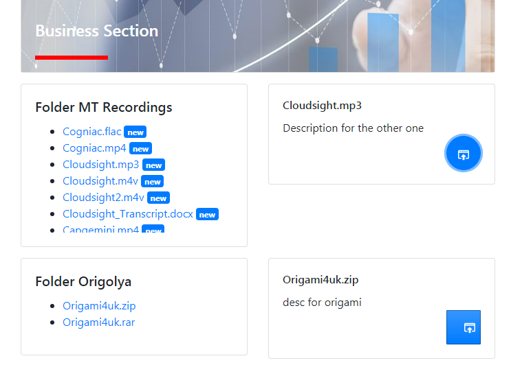

## Description

This app allows you to show the files on your Google Drive in a nice web interface.
Administrators can add description for each file on the drive. The code is build on
[Nest](https://github.com/nestjs/nest) framework **TypeScript** starter repository.

Authentication with user credentials is built in. List of files downloaded from Google Drive
is cached for performance. Files are split into several sections according to the
folder structure on Google Drive. Clicking on the file will show it's description and allows
to open the file in a new tab.



## Installation

```bash
$ npm install
```

You need to follow the Step 1 of the [guide here](https://developers.google.com/drive/v3/web/quickstart/nodejs) to enable authentication to the Google Drive.
Put the downloaded credentials file to ``.credentials`` folder.

## Start

```
$ npm run start
```

Then navigate to http://localhost:3000/ to test it.

## Support

Hire me to help you install or modify this project or ask questions here in GitHub issues.
